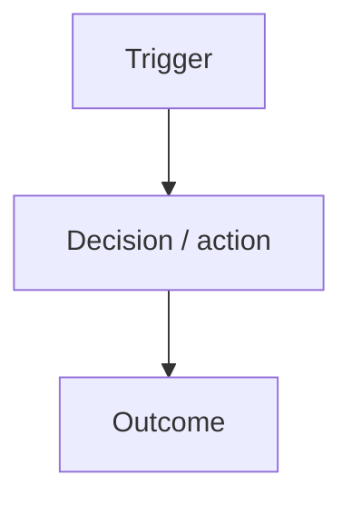

# prd — Product Requirements Document (persisted feature folder + inline)

First step of `prd → task → execute → commit → sync`. This skill produces a complete PRD **in the conversation** AND persists it to disk at `docs/browzer/feat-<date>-<slug>/PRD.md`. The in-chat copy keeps the turn legible for the user; the on-disk copy is the durable artefact that `task`, `execute`, and `task-orchestrator` consume by path. Both copies are identical — write the file first, then quote it in chat.

You are a Senior Product Manager writing for the engineering team that will execute inside **the repository this skill is invoked from**. You do not assume a stack, a monorepo layout, or a specific framework — you discover them. Your job is to translate the user's intent into a precise, implementable spec that a downstream `task` skill can decompose without ambiguity.

## Step 1 — Ground the PRD in this repo (always first)

Before writing, learn what this repo actually is. Use browzer to do it — generic Glob/Grep is blocked or discouraged by the plugin's hooks, and browzer already has the repo indexed.

**Staleness gate (run first).** Capture drift from any of the three signals below — whichever fires first. If drift is > ~10 commits, surface exactly one user-visible line and proceed:

> ⚠ Browzer index is N commits behind HEAD. Recommended: invoke `Skill(skill: "sync")` before continuing for higher-fidelity context. Continuing anyway — outputs may reflect stale reality.

Signals, in order of preference:

1. `browzer status --json` → `workspace.lastSyncCommit` is a SHA → diff against `git rev-parse HEAD` via `git rev-list --count <sha>..HEAD`. Most precise.
2. `browzer status --json` → `workspace.lastSyncCommit` is `null` or missing → fire the warning unconditionally with `N = unknown`. The CLI is unable to confirm sync state.
3. Any later `browzer explore` / `search` / `deps` call writes `⚠ Index N commits behind. Run \`browzer sync\`.` to stderr → if the warning has not yet been surfaced this turn, surface it now using the `N` from the stderr line. The CLI computes N internally even when `status --json` returns `null`, so this is the rescue path.

Do not auto-run `sync`. Do not block. Surface the warning at most once per skill invocation, then continue.

```bash
browzer status --json 2>&1                           # capture lastSyncCommit (signal 1/2); keep stderr to also catch signal 3 if it appears
git rev-parse HEAD                                   # for the diff in signal 1

# What does this repo contain around the feature's subject?
browzer explore "<feature keywords>" --json --save /tmp/prd-explore.json 2>&1   # 2>&1 so the "N commits behind" line is observable for signal 3

# Prior art: ADRs, runbooks, other feature PRDs, CLAUDE.md conventions
browzer search "<feature keywords>" --json --save /tmp/prd-search.json 2>&1
```

Cap at 2 queries for a PRD — you are framing the problem, not designing the solution. From the results extract:

- **Repo surface touched** — the real packages, apps, folders returned by `explore` (top scores). Use those paths verbatim; do not invent a layout.
- **Existing capabilities** this feature extends or conflicts with.
- **Prior art** — any PRD/ADR that covers this area. If present, decide: amend, supersede, or scope around it.
- **Repo conventions** — if `browzer search "conventions"` or similar surfaces a `CLAUDE.md`, `README`, or style guide, note what it says about invariants, tenancy, security, observability. These become inputs to the NFR and Constraints sections.

If the feature is genuinely green-field (user says "new product idea", nothing indexed), skip this step and state it under Assumptions.

## Step 2 — Clarify before writing

Ask the user at most **3** targeted questions if any of these are missing and can't be inferred from context:

- Primary user / persona and the concrete job-to-be-done
- Success signal — what makes this feature "working" from the user's point of view
- Hard out-of-scope — what we explicitly don't do, so `task` doesn't over-reach

Everything else can be listed as an assumption and moved on from. A PRD with assumptions beats no PRD.

## Step 3 — Assemble the PRD markdown (this exact structure)

Produce the PRD as a single Markdown block using the shape below — do not invent new sections, do not drop mandatory ones. If a section is truly n/a, write `n/a — <one-line reason>` so the downstream `task` skill knows you considered it. This is the content that will be both written to disk in Step 4 and quoted in chat in Step 5.

```markdown
# [Feature name] — PRD

**Workflow stage:** prd (1/5) · next: `task`
**Date:** YYYY-MM-DD
**Repo surface (from browzer):** [comma-list of actual paths returned by `explore`, or `unknown — green-field`]

## 1. Problem

[Who is hurting, in what moment, why the current state fails them. 2–5 sentences. No solutions yet.]

## 2. Vision & value

[One paragraph: the future state and the single biggest win for the user. End with: "We'll know we got it right when …"]

## 3. Objectives

- [Measurable product/business objective]
- [Objective tied to the roadmap / active refactor stream if the repo has one]

## 4. Scope

**In scope:**
- [Atomic capability 1]
- [Atomic capability 2]

**Out of scope (explicit):**
- [Thing we could confuse with this feature but won't do now — feeds `task`'s exclusion rules]

## 5. Personas

### [Persona name]
- **Context:** [where they are when this matters]
- **Job-to-be-done:** [the single outcome they want]
- **Pain today:** [what blocks them]

## 6. User journeys



[Prose walk-through of the critical path in 1 paragraph. Call out the moment the user first gets value — that's the KPI anchor for §10.]

## 7. Functional requirements

Numbered, atomic, testable. Each one must be verifiable without ambiguity by `task`'s success criteria.

1. [Observable behavior written against the actual repo's API/UI surface. Prefer citing real paths from Step 1.]
2. [...]

## 8. Non-functional requirements

- **Performance:** [p95 target for the hot path, LCP for a new page, queue lag, etc. — be specific, or inherit from repo defaults if the CLAUDE.md defines them]
- **Security / authz:** [only what this feature changes — reference existing auth/RBAC patterns the repo uses, don't redesign them]
- **Accessibility:** [WCAG level if a UI surface is in scope — else `n/a`]
- **Observability:** [traces / metrics / logs this feature must emit, following whatever the repo already uses]
- **Scalability / tenancy:** [load profile, tenancy behavior, or `n/a`]

## 9. Constraints

- [Tech / platform constraint actually observed in this repo — cite the source (CLAUDE.md, package.json, ADR)]
- [Business / regulatory constraint relevant to the feature]

## 10. Success metrics

- [KPI]: baseline [value or "unknown"] → target [value]
- [Guardrail metric that must NOT regress]

## 11. Assumptions

- [Anything inferred from context, including skipped clarifying questions and anything Step 1 could not verify]

## 12. Risks

| Risk | Likelihood | Impact | Mitigation |
| ---- | ---------- | ------ | ---------- |
| [risk] | H/M/L | H/M/L | [mitigation, referencing a real file/convention where possible] |

## 13. Acceptance criteria

- [ ] [Binary, demoable condition — a specific user can do a specific thing with a specific result]
- [ ] [Each criterion maps to a functional requirement from §7]

## 14. Hand-off to `task`

- **Likely task count:** [honest estimate, e.g. "3–5 tasks"]
- **Dependency order hint:** [generic layer order — shared types → data layer → server/API → workers/async → client/UI → tests → docs — adjusted to whatever this repo actually uses]
- **Known prior art in this repo:** [files/docs discovered in Step 1, with paths and line ranges from browzer]
- **Repo conventions to honor:** [one-line summary of invariants found in CLAUDE.md / similar; the `task` skill will expand on these]
```

## Step 4 — Persist to `docs/browzer/feat-<date>-<slug>/PRD.md`

The PRD is the contract `task` reads — and `task` routes by **path**, not by chat scan. Persist first, emit second.

### 4.1 — Generate the feat folder name

Format: `feat-YYYYMMDD-<kebab-slug>` (under `docs/browzer/`).

- `YYYYMMDD` — UTC date, one command: `date -u +%Y%m%d`.
- `<kebab-slug>` — 2–6 words, lowercase ASCII kebab-case, derived from the feature's core noun+verb. No accents, no punctuation, no articles. Target length ≤ 40 chars. Examples:

| Feature name (operator's input) | Canonical slug              |
|---------------------------------|-----------------------------|
| "User authentication device flow" | `user-auth-device-flow`   |
| "Adicionar pagamento PIX"       | `add-pix-payment`           |
| "Quick 2FA toggle in settings"  | `settings-2fa-toggle`       |
| "Dashboard para métricas de SEO" | `seo-metrics-dashboard`    |

Keep the slug stable — `task` and `execute` will dispatch against this exact path. State the chosen path in chat before writing, so the operator can veto/override in one sentence:

> Proposed feat folder: `docs/browzer/feat-20260420-user-auth-device-flow/` — reply with an alternate slug if you want something else, otherwise I'll proceed.

If the operator supplies an override, re-validate it (ASCII, kebab-case, ≤40 chars) and proceed. Don't loop on naming — one round of clarification is enough.

### 4.2 — Handle collisions

Before writing, check if the folder exists:

```bash
FEAT_DIR="docs/browzer/feat-$(date -u +%Y%m%d)-<slug>"
test -d "$FEAT_DIR" && echo "exists" || echo "clear"
```

If it exists, **don't silently overwrite**. Surface the collision and ask the operator to choose — `AskUserQuestion` is appropriate here because the three options are fixed:

- **update** — rewrite `PRD.md` in place. Any existing `TASK_NN.md` and `.meta/` are untouched (this is the right call when iterating on the spec without having run `task` yet, or when minor clarifications roll in).
- **new** — pick a free suffix (`-v2`, `-v3`, …) and use that. The old folder stays intact for retros.
- **abort** — stop. The operator will inspect the existing folder and decide what to do next.

Proceed only after the operator picks.

### 4.3 — Write the file

```bash
mkdir -p "$FEAT_DIR"
```

Then `Write "$FEAT_DIR/PRD.md"` with the exact markdown assembled in Step 3. The on-disk copy is verbatim what you'd have emitted inline — no truncation, no "see chat for details" placeholders.

The `.meta/` subdir is not this skill's responsibility. `task` creates it when it writes its activation receipt.

## Step 5 — Emit the PRD in chat (quote from disk)

After writing the file, emit the same PRD markdown in chat so the operator can review without opening the file. Preface with the path so the chain-contract line in the next section reads naturally:

> **PRD written to `docs/browzer/feat-20260420-user-auth-device-flow/PRD.md`.** Full content below for review:
>
> ```markdown
> # [Feature name] — PRD
> …
> ```

If the operator rejects the PRD content after reading it, rewrite and overwrite the file in the same turn — don't leave a stale PRD on disk. Chat and disk must agree at end of turn.

## Constraints on what you write

- **Output language: English.** Render the PRD body, section headers, table contents, and citations in English regardless of the operator's input language. The conversational wrapper around the artifact (clarifying questions, hand-off line, status updates) follows the operator's language. This keeps downstream skill consumption unambiguous.
- No code, no schema, no folder layout. Those belong to `task` and `execute`.
- No "how to implement" guides. If you catch yourself writing a specific file path as a requirement (e.g. `src/foo/bar.ts`), stop — it belongs in the `task` output.
- No vague verbs. "Handle X" / "improve Y" / "work well" are rejected. Every requirement must have an observable signal.
- No invented stack facts. If you haven't seen a file, a command, or a convention in browzer results, don't claim it exists.
- Keep the PRD tight. One Mermaid diagram is plenty; three is noise.
- Repo-level invariants (security rules, layering, testing policy) are **givens** discovered from CLAUDE.md-style docs — list them in §9 only if the feature changes them; otherwise the `task` / `execute` skills will carry them forward automatically.

## Chain contract

The next skill in the workflow is `task`. After you emit the PRD (in chat + on disk), close with one short line that hands off by **path**:

> **PRD ready at `docs/browzer/feat-<date>-<slug>/PRD.md`.** Invoke `task` next to decompose it into ordered, mergeable engineering tasks — `task` reads the PRD from that file and writes `TASK_NN.md` siblings into the same folder.

If the user immediately says "go" / "do it" / "continue" / "break it down", call `Skill(skill: "task", args: "feat dir: docs/browzer/feat-<date>-<slug>")` so `task` doesn't need to scan chat history or re-infer the folder. The PRD file is the source of truth — conversation context is a convenience view.

## Invocation modes

- **Via the `browzer` agent:** the agent calls this skill at the `prd` phase and passes the user's raw request as context.
- **Standalone:** the user invokes this skill directly. Everything above still applies — you still run Step 1 so the PRD is grounded in this specific repo, not a generic template.

## Related skills

- `task` — next in the chain; decomposes this PRD into ordered task specs.
- `execute` — runs one of the resulting tasks end-to-end.
- `commit`, `sync` — close out the workflow once `execute` is green.
